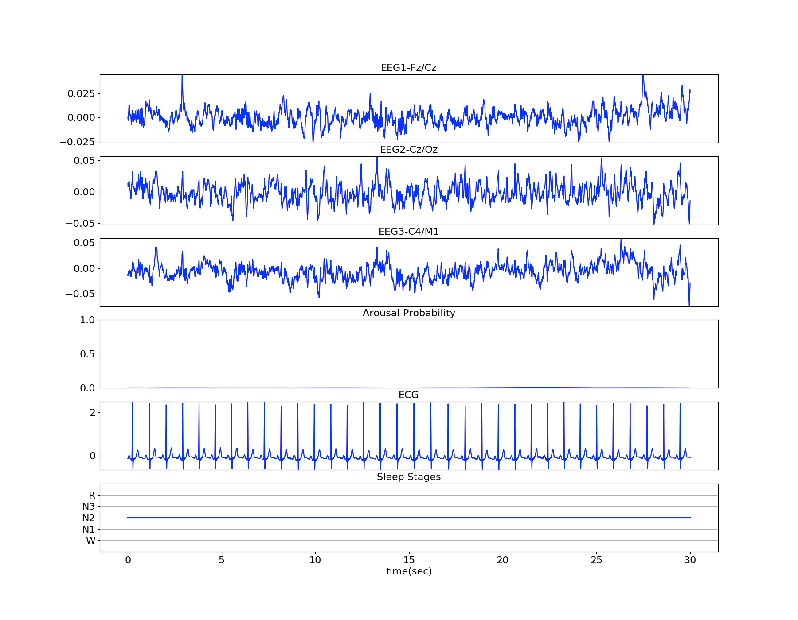

# Deep Cortical Arousal Detection (DeepCAD)

# Introduction
A cortical arousal detection algorithm that uses a 
single-lead ECG to detect arousal during sleep.

# Description
This repo contains training and inference code for DeepCAD in PyTorch. 
Training is done on Multi-Ethnic Study of Atherosclerosis (MESA) 
dataset: https://sleepdata.org/datasets/mesa

# Requirements

Python 3.5 or later

* torch >= 1.0.0

# Training

```bash
python train.py project_path dataset_path model_folder n_epochs n_batch lr weight_decay
```

# Inference
```bash
python detect.py detected_arousal deepcad.pth.tar model example_psg.hdf 0.40
```

**Example:**

